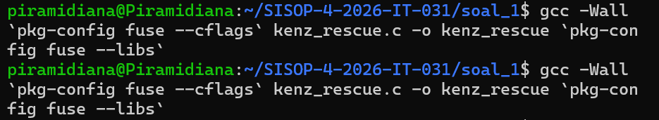
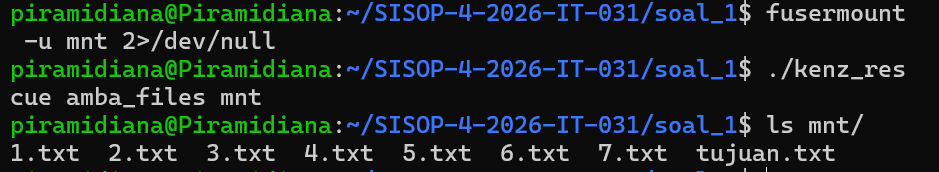
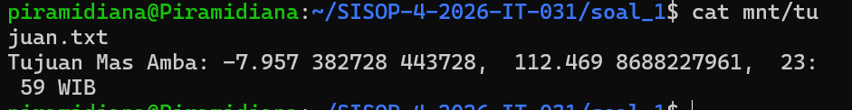
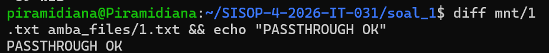
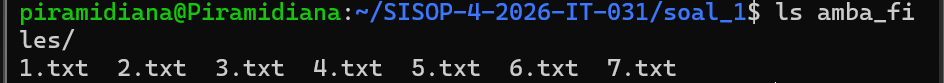
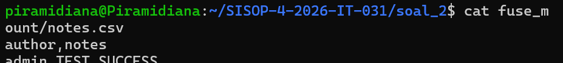
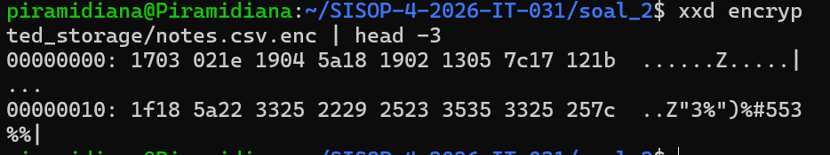
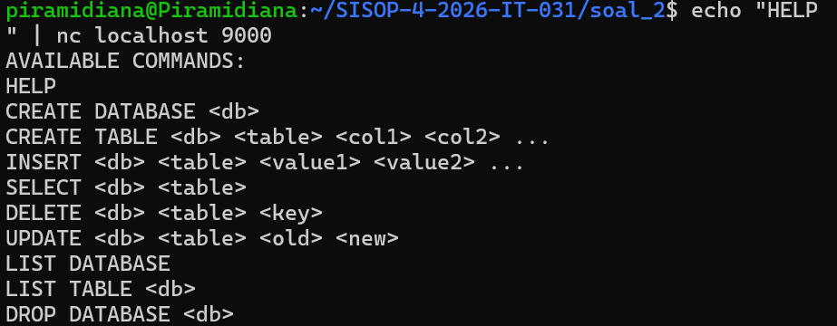
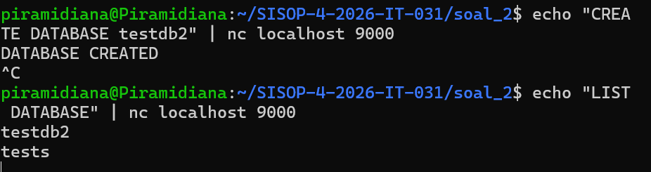

# Praktikum Sistem Operasi Modul 4

## Identitas
| Nama | NRP |
|------|-----|
| Dian Piramidiana Rachmatika | 5027251031 |

---

## Soal 1 - Save Asisten Kenz

### Penjelasan

Program `kenz_rescue.c` adalah implementasi **FUSE (Filesystem in Userspace)** berbahasa C yang me-mount direktori `amba_files/` ke direktori `mnt/` sebagai filesystem cermin dengan tambahan satu file virtual.

Sebelum ngoding, ada langkah persiapan dulu yaitu download file `amba_files.zip` dari Google Drive pakai `gdown`, diekstrak jadi folder `amba_files/` yang berisi `1.txt` sampai `7.txt`, lalu file zip-nya dihapus biar ga nyisa di working directory.

Program menerima dua argumen saat dijalankan:
- `<source_dir>` → folder sumber yang berisi file-file asli (amba_files/)
- `<mount_dir>` → folder tujuan mount point (mnt/)

Cara kerja program:

**Passthrough FUSE (Soal b):**
Saat program di-mount, ketujuh file (`1.txt`-`7.txt`) muncul di `mnt/` dengan isi yang byte-identical sama `amba_files/`. Setiap operasi baca diteruskan langsung ke file sumber tanpa modifikasi apapun.

**File virtual `tujuan.txt` (Soal c):**
File `tujuan.txt` ga ada secara fisik di `amba_files/`, tapi tetap muncul di `mnt/` saat `ls` dijalankan. File ini murni hidup di lapisan FUSE — ukurannya konsisten saat di-`stat`, tapi ga ada wujud fisiknya di storage.

**Konten on-the-fly (Soal d):**
Saat `cat mnt/tujuan.txt` dijalankan, kontennya dibangkitkan real-time oleh fungsi `build_tujuan()`. Fungsi ini buka `1.txt` sampai `7.txt` secara urut, cari baris yang diawali `KOORD:`, ambil nilainya (bagian setelah "KOORD: "), lalu gabungkan semua nilai dengan spasi. Format output: `Tujuan Mas Amba: <nilai1> <nilai2> ...` diakhiri satu newline.

### Kode Program

```c
#define FUSE_USE_VERSION 28
#include <fuse.h>
#include <stdio.h>
#include <string.h>
#include <unistd.h>
#include <fcntl.h>
#include <dirent.h>
#include <errno.h>
#include <stdlib.h>
#include <sys/stat.h>

static char source_dir[2048];

// Gabungkan source_dir + path FUSE jadi path lengkap di disk
// Contoh: source_dir="amba_files", path="/1.txt" → "amba_files/1.txt"
static void get_full_path(char *full_path, const char *path) {
    snprintf(full_path, 2048, "%s%s", source_dir, path);
}

// Buat konten tujuan.txt secara on-the-fly
// Buka file 1.txt sampai 7.txt satu per satu, cari baris "KOORD:",
// ambil nilainya, gabungkan semua dengan spasi
// Format hasil: "Tujuan Mas Amba: val1 val2 ... val7\n"
static void build_tujuan(char *out, size_t *out_len) {
    char result[4096] = "Tujuan Mas Amba: ";
    int first = 1;
    for (int i = 1; i <= 7; i++) {
        char filepath[4096];
        sprintf(filepath, "%s/%d.txt", source_dir, i);
        FILE *fp = fopen(filepath, "r");
        if (!fp) continue;
        char line[512];
        while (fgets(line, sizeof(line), fp)) {
            // Cek apakah baris diawali "KOORD:"
            if (strncmp(line, "KOORD:", 6) == 0) {
                char *value = line + 7; // lewati "KOORD: " (7 karakter)
                value[strcspn(value, "\n")] = '\0'; // hapus newline
                if (!first) strcat(result, " ");
                strcat(result, value);
                first = 0;
                break; // satu file satu KOORD
            }
        }
        fclose(fp);
    }
    strcat(result, "\n");
    strcpy(out, result);
    *out_len = strlen(result);
}

// getattr: dipanggil sistem buat ambil atribut file (ukuran, permission, dll)
// Kalau path adalah "/tujuan.txt" → buat atribut secara manual (virtual file)
// Kalau path lain → ambil atribut langsung dari disk pakai lstat()
static int xmp_getattr(const char *path, struct stat *stbuf) {
    if (strcmp(path, "/tujuan.txt") == 0) {
        memset(stbuf, 0, sizeof(struct stat));
        stbuf->st_mode = S_IFREG | 0444; // file reguler, read-only
        stbuf->st_nlink = 1;
        char content[4096];
        size_t len;
        build_tujuan(content, &len);
        stbuf->st_size = len; // ukuran = panjang konten yang di-generate
        return 0;
    }
    char full_path[2048];
    get_full_path(full_path, path);
    int res = lstat(full_path, stbuf);
    if (res == -1) return -errno;
    return 0;
}

// readdir: dipanggil saat user buka folder (ls)
// Tampilin semua file dari disk pakai opendir/readdir,
// lalu kalau path adalah root ("/") tambahkan entry "tujuan.txt" virtual
static int xmp_readdir(const char *path, void *buf, fuse_fill_dir_t filler,
                        off_t offset, struct fuse_file_info *fi) {
    (void) offset; (void) fi;
    char full_path[2048];
    get_full_path(full_path, path);
    DIR *dp = opendir(full_path);
    if (dp == NULL) return -errno;
    struct dirent *de;
    while ((de = readdir(dp)) != NULL) {
        struct stat st;
        memset(&st, 0, sizeof(st));
        st.st_ino = de->d_ino;
        st.st_mode = de->d_type << 12;
        if (filler(buf, de->d_name, &st, 0)) break;
    }
    closedir(dp);
    // Tambahkan tujuan.txt virtual hanya di root directory
    if (strcmp(path, "/") == 0) {
        struct stat st;
        memset(&st, 0, sizeof(st));
        st.st_mode = S_IFREG | 0444;
        filler(buf, "tujuan.txt", &st, 0);
    }
    return 0;
}

// open: dipanggil saat user mau buka file (sebelum read)
// tujuan.txt virtual → langsung return 0 (selalu berhasil)
// File lain → buka dari disk pakai open()
static int xmp_open(const char *path, struct fuse_file_info *fi) {
    if (strcmp(path, "/tujuan.txt") == 0) return 0;
    char full_path[2048];
    get_full_path(full_path, path);
    int res = open(full_path, fi->flags);
    if (res == -1) return -errno;
    close(res);
    return 0;
}

// read: dipanggil saat user baca isi file
// tujuan.txt → generate konten on-the-fly pakai build_tujuan(),
//              lalu copy ke buf sesuai offset dan size yang diminta
// File lain → baca langsung dari disk pakai pread() (passthrough)
static int xmp_read(const char *path, char *buf, size_t size,
                     off_t offset, struct fuse_file_info *fi) {
    (void) fi;
    if (strcmp(path, "/tujuan.txt") == 0) {
        char content[4096];
        size_t len;
        build_tujuan(content, &len);
        if (offset >= (off_t)len) return 0; // sudah EOF
        size_t to_copy = len - offset;
        if (to_copy > size) to_copy = size;
        memcpy(buf, content + offset, to_copy);
        return to_copy;
    }
    char full_path[2048];
    get_full_path(full_path, path);
    int fd = open(full_path, O_RDONLY);
    if (fd == -1) return -errno;
    int res = pread(fd, buf, size, offset);
    if (res == -1) res = -errno;
    close(fd);
    return res;
}

// access: cek apakah user punya izin akses file
// tujuan.txt virtual → selalu izinkan
// File lain → cek dari disk pakai access()
static int xmp_access(const char *path, int mask) {
    if (strcmp(path, "/tujuan.txt") == 0) return 0;
    char full_path[2048];
    get_full_path(full_path, path);
    int res = access(full_path, mask);
    if (res == -1) return -errno;
    return 0;
}

static struct fuse_operations xmp_oper = {
    .getattr = xmp_getattr,
    .readdir = xmp_readdir,
    .open    = xmp_open,
    .read    = xmp_read,
    .access  = xmp_access,
};

// main: ambil source_dir dari argv[1] pakai realpath() biar jadi path absolut,
// geser argv supaya fuse_main cuma nerima mount_dir di argv[1],
// lalu jalankan FUSE
int main(int argc, char *argv[]) {
    if (argc < 3) {
        fprintf(stderr, "Usage: %s <source_dir> <mount_dir>\n", argv[0]);
        return 1;
    }
    if (realpath(argv[1], source_dir) == NULL) {
        perror("realpath");
        return 1;
    }
    argv[1] = argv[2]; // geser mount_dir ke argv[1]
    argc--;
    umask(0);
    return fuse_main(argc, argv, &xmp_oper, NULL);
}
```

### Cara Menjalankan

```bash
# Install dependensi FUSE
sudo apt install libfuse-dev pkg-config fuse

# Compile
gcc -Wall `pkg-config fuse --cflags` kenz_rescue.c -o kenz_rescue `pkg-config fuse --libs`

# Download dan ekstrak amba_files
pip install gdown --break-system-packages
gdown "1nLXFhptDo2mnUlZsw8pTWyAVpV49W20U" -O amba_files.zip
unzip amba_files.zip
rm amba_files.zip

# Buat mount point dan jalankan FUSE
mkdir -p mnt
./kenz_rescue amba_files mnt

# Verifikasi (di terminal lain)
ls mnt/
cat mnt/tujuan.txt
diff mnt/1.txt amba_files/1.txt && echo "PASSTHROUGH OK"

# Unmount setelah selesai
fusermount -u mnt
```

### Dokumentasi

**Screenshot 1 - Compile berhasil**

Proses kompilasi `kenz_rescue.c` pakai flag FUSE berhasil tanpa error, menghasilkan binary `kenz_rescue`.



**Screenshot 2 - ls mnt/ setelah di-mount**

`ls mnt/` nampilin 8 entry: `1.txt` sampai `7.txt` (passthrough dari `amba_files/`) plus `tujuan.txt` yang merupakan file virtual — ga ada fisiknya di `amba_files/`.



**Screenshot 3 - Isi tujuan.txt**

`cat mnt/tujuan.txt` nampilin konten yang di-generate on-the-fly: gabungan semua nilai `KOORD:` dari `1.txt` sampai `7.txt` dengan format `Tujuan Mas Amba: ...`.



**Screenshot 4 - Verifikasi passthrough**

`diff mnt/1.txt amba_files/1.txt && echo "PASSTHROUGH OK"` tidak ada output diff sama sekali, membuktikan isi file di mount point byte-identical sama sumbernya.



**Screenshot 5 - tujuan.txt tidak ada di amba_files**

`ls amba_files/` cuma nampilin 7 file (`1.txt`-`7.txt`), membuktikan `tujuan.txt` adalah file virtual yang murni hidup di lapisan FUSE dan ga punya wujud fisik di storage.



---

### Kendala

1. **Error `No such file or directory` saat compile** — Terminal tidak berada di folder yang sama dengan `kenz_rescue.c`. Solusinya `cd ~/SISOP-4-2026-IT-031/soal_1` dulu sebelum compile.

2. **Download `amba_files.zip` via `curl` gagal** — Google Drive ngembaliin halaman HTML konfirmasi (3KB) bukan file zip asli. Solusinya pakai `gdown` yang handle konfirmasi Google Drive secara otomatis.

3. **Warning `Wformat-truncation` saat compile** — GCC kasih warning soal kemungkinan truncation di `sprintf` meskipun secara praktek ga akan terjadi karena path source_dir jauh di bawah batas buffer. Warning ini ga bikin program gagal compile dan jalannya tetap normal. Solusinya perbesar buffer dari 2048 ke 4096.

4. **`git push` ditolak error 403** — GitHub udah ga nerima password akun biasa sejak 2021. Solusinya bikin Personal Access Token (PAT) di Settings → Developer settings → Tokens (classic) dan pakai token itu sebagai password saat push.

5. **`git push -u origin main` gagal `src refspec main does not match any`** — Branch lokal namanya `master` bukan `main`. Solusinya ganti perintah jadi `git push -u origin master`.

---

## Soal 2 - Poke MOO

### Penjelasan

Soal 2 terdiri dari 3 komponen yang saling terhubung: **FUSE enkripsi XOR**, **Docker container**, dan **TCP client-server**.

Gambaran besar cara kerjanya:
- `encrypted_storage/` = folder penyimpanan file yang tersimpan dalam bentuk terenkripsi (nama file + `.enc`)
- `fuse_mount/` = mount point FUSE yang jadi "jendela transparan" — semua file kelihatan normal tapi sebenernya dienkripsi/dekripsi otomatis
- Saat **write** ke `fuse_mount/` → FUSE enkripsi semua byte dengan XOR key `0x76` → simpan ke `encrypted_storage/` dengan nama `namafile.enc`
- Saat **read** dari `fuse_mount/` → FUSE ambil file `.enc` dari `encrypted_storage/`, dekripsi XOR → tampilin teks asli ke user
- `server` binary (dikasih dari soal) dijalankan di dalam Docker container dengan workdir `/app/db` yang di-bind mount ke `fuse_mount/`, jadi database-nya otomatis tersimpan terenkripsi
- `client.c` konek ke server via TCP port 9000 buat operasi database

**Kenapa XOR?** XOR adalah operasi yang reversible — `A XOR K = B`, dan `B XOR K = A`. Jadi enkripsi dan dekripsi pakai fungsi yang sama persis (`xor_data()`), tinggal panggil dua kali balik ke semula.

**File `fuse.c`:**
Mengimplementasikan semua fungsi FUSE yang diperlukan: `getattr`, `readdir`, `open`, `read`, `write`, `create`, `unlink`, `mkdir`, `rmdir`, `truncate`, `access`, dan `utimens`. Dua fungsi terpenting adalah `read` (untuk dekripsi) dan `write` (untuk enkripsi).

**File `client.c`:**
Program TCP client sederhana yang konek ke `localhost:9000`. Setelah konek, terima welcome message dari server, lalu masuk ke loop interaktif: tampilin prompt `db >`, baca input user, kirim ke server via socket, terima dan tampilin response.

**File `Dockerfile`:**
Build image dari `ubuntu:latest`, copy binary `server` ke `/app`, set workdir `/app`, expose port 9000, dan jalankan `./server` saat container start.

### Kode Program

**fuse.c:**

```c
#define FUSE_USE_VERSION 28
#include <fuse.h>
#include <stdio.h>
#include <string.h>
#include <unistd.h>
#include <fcntl.h>
#include <dirent.h>
#include <errno.h>
#include <stdlib.h>
#include <sys/stat.h>
#include <sys/time.h>

#define XOR_KEY 0x76
static char enc_storage[4096];

// XOR semua byte di buffer dengan key 0x76
// Fungsi ini dipanggil saat write (enkripsi) dan saat read (dekripsi)
// XOR bersifat reversible: A^K^K = A, jadi satu fungsi bisa dua arah
static void xor_data(char *buf, size_t size) {
    for (size_t i = 0; i < size; i++)
        buf[i] ^= XOR_KEY;
}

// Buat path file enkripsi dari path FUSE
// Contoh: path="/notes.csv" → enc_storage + "/" + "notes.csv" + ".enc"
// Contoh: path="/tests/data.csv" → enc_storage + "/tests/" + "data.csv" + ".enc"
static void get_enc_path(char *out, const char *path) {
    const char *base = strrchr(path, '/'); // cari '/' terakhir
    if (!base) base = path;
    char dir[4096];
    int dlen = base - path;
    strncpy(dir, path, dlen);
    dir[dlen] = '\0';
    snprintf(out, 4096, "%s%s/%s.enc", enc_storage, dir, base + 1);
}

// Buat path direktori dari path FUSE (untuk folder)
static void get_dir_path(char *out, const char *path) {
    snprintf(out, 4096, "%s%s", enc_storage, path);
}

// getattr: coba cari file .enc dulu, kalau ga ada coba sebagai folder
static int xmp_getattr(const char *path, struct stat *stbuf) {
    char ep[4096], dp[4096];
    get_enc_path(ep, path);
    get_dir_path(dp, path);
    if (lstat(ep, stbuf) == 0) return 0;
    if (lstat(dp, stbuf) == 0) return 0;
    return -ENOENT;
}

// readdir: baca isi folder dari enc_storage,
// tapi hapus suffix ".enc" dari nama file yang ditampilkan ke user
// Jadi user lihat "notes.csv" bukan "notes.csv.enc"
static int xmp_readdir(const char *path, void *buf, fuse_fill_dir_t filler,
                        off_t offset, struct fuse_file_info *fi) {
    (void) offset; (void) fi;
    char dp[4096];
    get_dir_path(dp, path);
    DIR *d = opendir(dp);
    if (!d) return -errno;
    struct dirent *de;
    while ((de = readdir(d)) != NULL) {
        struct stat st;
        memset(&st, 0, sizeof(st));
        st.st_ino = de->d_ino;
        st.st_mode = de->d_type << 12;
        char name[512];
        strncpy(name, de->d_name, sizeof(name));
        // Kalau file reguler dan namanya berakhiran ".enc", hapus suffixnya
        if (de->d_type == DT_REG) {
            int len = strlen(name);
            if (len > 4 && strcmp(name + len - 4, ".enc") == 0)
                name[len - 4] = '\0';
        }
        if (filler(buf, name, &st, 0)) break;
    }
    closedir(d);
    return 0;
}

// open: buka file .enc dari enc_storage
static int xmp_open(const char *path, struct fuse_file_info *fi) {
    char ep[4096];
    get_enc_path(ep, path);
    int res = open(ep, fi->flags);
    if (res == -1) return -errno;
    close(res);
    return 0;
}

// read: baca file .enc, lalu dekripsi dengan XOR sebelum dikirim ke user
// Urutan: buka file .enc → pread() → xor_data() → return ke user
static int xmp_read(const char *path, char *buf, size_t size,
                     off_t offset, struct fuse_file_info *fi) {
    (void) fi;
    char ep[4096];
    get_enc_path(ep, path);
    int fd = open(ep, O_RDONLY);
    if (fd == -1) return -errno;
    int res = pread(fd, buf, size, offset);
    close(fd);
    if (res == -1) return -errno;
    xor_data(buf, res); // dekripsi XOR
    return res;
}

// write: enkripsi data dengan XOR dulu, baru simpan ke file .enc
// Urutan: copy data ke buffer sementara → xor_data() → pwrite() ke file .enc
static int xmp_write(const char *path, const char *buf, size_t size,
                      off_t offset, struct fuse_file_info *fi) {
    (void) fi;
    char ep[4096];
    get_enc_path(ep, path);
    char *tmp = malloc(size); // buffer sementara untuk data terenkripsi
    if (!tmp) return -ENOMEM;
    memcpy(tmp, buf, size);
    xor_data(tmp, size); // enkripsi XOR
    int fd = open(ep, O_WRONLY);
    if (fd == -1) { free(tmp); return -errno; }
    int res = pwrite(fd, tmp, size, offset);
    close(fd);
    free(tmp);
    if (res == -1) return -errno;
    return res;
}

// create: buat file .enc baru di enc_storage
static int xmp_create(const char *path, mode_t mode, struct fuse_file_info *fi) {
    (void) fi;
    char ep[4096];
    get_enc_path(ep, path);
    int fd = open(ep, O_CREAT | O_WRONLY | O_TRUNC, mode);
    if (fd == -1) return -errno;
    close(fd);
    return 0;
}

// unlink: hapus file .enc dari enc_storage
static int xmp_unlink(const char *path) {
    char ep[4096];
    get_enc_path(ep, path);
    if (unlink(ep) == 0) return 0;
    char dp[4096];
    get_dir_path(dp, path);
    if (unlink(dp) == 0) return 0;
    return -errno;
}

// mkdir: buat folder baru di enc_storage
static int xmp_mkdir(const char *path, mode_t mode) {
    char dp[4096];
    get_dir_path(dp, path);
    if (mkdir(dp, mode) == -1) return -errno;
    return 0;
}

// rmdir: hapus folder dari enc_storage
static int xmp_rmdir(const char *path) {
    char dp[4096];
    get_dir_path(dp, path);
    if (rmdir(dp) == -1) return -errno;
    return 0;
}

// truncate: potong ukuran file di enc_storage
static int xmp_truncate(const char *path, off_t size) {
    char ep[4096];
    get_enc_path(ep, path);
    if (truncate(ep, size) == 0) return 0;
    char dp[4096];
    get_dir_path(dp, path);
    if (truncate(dp, size) == 0) return 0;
    return -errno;
}

// access: cek permission file di enc_storage
static int xmp_access(const char *path, int mask) {
    char ep[4096], dp[4096];
    get_enc_path(ep, path);
    get_dir_path(dp, path);
    if (access(ep, mask) == 0) return 0;
    if (access(dp, mask) == 0) return 0;
    return -errno;
}

// utimens: update timestamp file di enc_storage
static int xmp_utimens(const char *path, const struct timespec ts[2]) {
    char ep[4096];
    get_enc_path(ep, path);
    struct timeval tv[2];
    tv[0].tv_sec = ts[0].tv_sec; tv[0].tv_usec = ts[0].tv_nsec / 1000;
    tv[1].tv_sec = ts[1].tv_sec; tv[1].tv_usec = ts[1].tv_nsec / 1000;
    if (utimes(ep, tv) == 0) return 0;
    char dp[4096];
    get_dir_path(dp, path);
    if (utimes(dp, tv) == 0) return 0;
    return -errno;
}

static struct fuse_operations xmp_oper = {
    .getattr  = xmp_getattr,
    .readdir  = xmp_readdir,
    .open     = xmp_open,
    .read     = xmp_read,
    .write    = xmp_write,
    .create   = xmp_create,
    .unlink   = xmp_unlink,
    .mkdir    = xmp_mkdir,
    .rmdir    = xmp_rmdir,
    .truncate = xmp_truncate,
    .access   = xmp_access,
    .utimens  = xmp_utimens,
};

// main: ambil enc_storage dari argv[1] pakai realpath(),
// buat new_argv yang sudah include "-o allow_other" supaya Docker
// bisa akses fuse_mount yang di-mount oleh root,
// lalu jalankan FUSE
int main(int argc, char *argv[]) {
    if (argc < 3) {
        fprintf(stderr, "Usage: %s <encrypted_storage> <mount_point>\n", argv[0]);
        return 1;
    }
    if (realpath(argv[1], enc_storage) == NULL) {
        perror("realpath");
        return 1;
    }
    // Buat argv baru dengan allow_other hard-coded
    // Karena cara geser argv biasa ga work dengan opsi FUSE
    char *new_argv[8];
    int new_argc = 0;
    new_argv[new_argc++] = argv[0];
    new_argv[new_argc++] = argv[2]; // mount_point
    new_argv[new_argc++] = "-o";
    new_argv[new_argc++] = "allow_other";
    for (int i = 3; i < argc && new_argc < 7; i++)
        new_argv[new_argc++] = argv[i];
    new_argv[new_argc] = NULL;
    umask(0);
    return fuse_main(new_argc, new_argv, &xmp_oper, NULL);
}
```

**client.c:**

```c
#include <stdio.h>
#include <stdlib.h>
#include <string.h>
#include <unistd.h>
#include <arpa/inet.h>

#define PORT 9000
#define BUF 4096

int main() {
    // Buat socket TCP
    int sock = socket(AF_INET, SOCK_STREAM, 0);
    if (sock < 0) { perror("socket"); return 1; }

    // Setup alamat server: localhost port 9000
    struct sockaddr_in addr;
    addr.sin_family = AF_INET;
    addr.sin_port = htons(PORT);
    inet_pton(AF_INET, "127.0.0.1", &addr.sin_addr);

    // Konek ke server
    if (connect(sock, (struct sockaddr*)&addr, sizeof(addr)) < 0) {
        perror("connect");
        return 1;
    }

    // Terima welcome message dari server
    char buf[BUF];
    int n = recv(sock, buf, BUF - 1, 0);
    if (n > 0) { buf[n] = '\0'; printf("%s", buf); }

    // Loop interaktif: terima input user → kirim ke server → tampilin response
    while (1) {
        printf("db > ");
        fflush(stdout);
        if (!fgets(buf, BUF, stdin)) break; // EOF atau error
        send(sock, buf, strlen(buf), 0);    // kirim command ke server
        if (strncmp(buf, "EXIT", 4) == 0) break; // keluar kalau command EXIT
        n = recv(sock, buf, BUF - 1, 0);   // terima response
        if (n <= 0) break;
        buf[n] = '\0';
        printf("%s", buf);
    }

    close(sock);
    return 0;
}
```

**Dockerfile:**

```dockerfile
FROM ubuntu:latest
WORKDIR /app
COPY server .
RUN chmod +x server
EXPOSE 9000
CMD ["./server"]
```

### Cara Menjalankan

```bash
# Compile FUSE dan client
gcc -Wall `pkg-config fuse --cflags` fuse.c -o fuse_prog `pkg-config fuse --libs`
gcc client.c -o client

# Download server binary dan file test dari release
gdown --folder "https://drive.google.com/drive/folders/1e7-ScSf2xa3QQuIqAakhewfptyt4L3t-"

# Siapkan folder
mkdir -p encrypted_storage fuse_mount
cp release/server .
cp release/notes.csv.enc encrypted_storage/
mkdir -p encrypted_storage/tests
cp release/notes.csv.enc encrypted_storage/tests/

# Aktifkan allow_other untuk FUSE (supaya Docker bisa akses)
echo "user_allow_other" | sudo tee -a /etc/fuse.conf

# Mount FUSE sebagai root (pakai sudo supaya Docker bisa akses)
sudo ./fuse_prog encrypted_storage fuse_mount

# Build Docker image
sudo docker build -t soal-2-modul-4-sisop .

# Jalankan container dengan bind mount fuse_mount ke /app/db
sudo docker run -d --name db_app \
  --mount type=bind,source=$(pwd)/fuse_mount,target=/app/db \
  -p 9000:9000 \
  soal-2-modul-4-sisop

# Verifikasi FUSE dekripsi
cat fuse_mount/notes.csv

# Test server via netcat
echo "HELP" | nc localhost 9000
echo "CREATE DATABASE testdb" | nc localhost 9000
echo "LIST DATABASE" | nc localhost 9000
echo "CREATE TABLE testdb users name password" | nc localhost 9000
echo "INSERT testdb users admin password123" | nc localhost 9000
echo "SELECT testdb users" | nc localhost 9000

# Unmount dan stop container
sudo fusermount -u fuse_mount
sudo docker stop db_app
```

### Dokumentasi

**Screenshot 1 - FUSE berhasil dekripsi**

`cat fuse_mount/notes.csv` nampilin isi terdekripsi `author,notes / admin,TEST_SUCCESS`, padahal di `encrypted_storage/` filenya tersimpan dalam bentuk binary terenkripsi.



**Screenshot 2 - File terenkripsi di encrypted_storage**

`xxd encrypted_storage/notes.csv.enc` nampilin data binary acak, membuktikan file yang tersimpan sudah terenkripsi XOR dan ga bisa dibaca langsung.



**Screenshot 3 - Docker container berjalan**

`docker ps` nampilin container `db_app` dengan image `soal-2-modul-4-sisop` yang berjalan di port 9000, plus container soal 3 yang juga aktif.


**Screenshot 4 - Server HELP response**

`echo "HELP" | nc localhost 9000` nampilin semua command yang tersedia: `HELP`, `CREATE DATABASE`, `CREATE TABLE`, `INSERT`, `SELECT`, `DELETE`, `UPDATE`, `LIST DATABASE`, `LIST TABLE`, `DROP DATABASE`.



**Screenshot 5 - Database operations berhasil**

`CREATE DATABASE testdb2` → `DATABASE CREATED`, `LIST DATABASE` → nampilin `testdb2` dan `tests`. Membuktikan database tersimpan persistent di `fuse_mount/` yang otomatis dienkripsi ke `encrypted_storage/`.



---

### Kendala

1. **Docker tidak bisa akses `fuse_mount` (permission denied)** — Docker daemon jalan sebagai root tapi FUSE di-mount oleh user biasa, jadi Docker ga bisa akses mount point. Solusinya jalankan FUSE dengan `sudo` dan aktifkan `user_allow_other` di `/etc/fuse.conf`, lalu hard-code `allow_other` di `new_argv` yang dikirim ke `fuse_main`.

2. **`fuse: invalid argument 'fuse_mount'` saat coba pakai `-o allow_other`** — Urutan argumen salah karena cara kita geser `argv` di `main()` tidak kompatibel dengan opsi FUSE tambahan. Solusinya modifikasi `main()` buat `new_argv` baru yang hard-code `allow_other`.

3. **`fuse: mountpoint is not empty`** — `fuse_mount` sudah ada isinya (folder `testdb` dari sesi sebelumnya) jadi FUSE ga mau mount. Solusinya tambahkan flag `-o nonempty` saat mount ulang.

4. **`DATABASE CREATED` tapi `LIST DATABASE` bilang `No databases found`** — Ternyata server binary punya path hardcoded `/app/db`, bukan argumen yang kita kasih di command line. Jadi server harus dijalankan di dalam Docker yang bind mount `fuse_mount` ke `/app/db`.

5. **Port 9000 `Address already in use`** — Ada sisa proses server yang masih jalan di background. Solusinya `kill $(lsof -t -i:9000)` dan `sudo docker rm -f db_app`.

